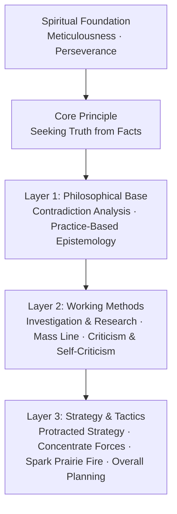

<p align="center">
  
</p>

# 🔴 Qiushi Skill — Arming the AI Mind

> 🌍 [中文](README.md) | **English**

> 🌟 "Our comrades must see achievements, see the bright side, and raise our courage in times of difficulty."

> ✊ "The world fears nothing more than the word 'serious'."


<p align="center">
  <a href="https://hughyau.com/qiushi-skill/">
    
  </a>
</p>

---

**Your AI should not be an obsequious tool. It should be an actor that examines facts first, then makes judgments.**

"Qiushi Skill" is a collection of AI Agent Skills, distilling one overarching principle and nine methodological tools from the teachings of Chairman Mao. These are not slogans or platitudes, but an actionable set of methodologies that systematically arm the AI mind.

Every method is grounded in evidence and traceable, directly quoting from the Selected Works (see `original-texts.md` in each skill directory).

## 🔍 Why Is This Needed?

Current AI Agents have a fundamental problem: **They can think, but they don't know how to "think about problems."**

- 🌀 Facing complex problems, they try to grab everything at once and miss the key point
- 🗣️ They rush to give answers without investigation, committing the error of dogmatism
- 😴 They don't self-review after completing work — "good enough" is their standard
- 🏳️ When encountering difficulty, they say "this is beyond my capability," lacking the ability to push forward
- 🎯 They try to do ten things at once, doing none well, not understanding how to concentrate forces

The methodologies in Mao's thought — contradiction analysis, practice-based epistemology, investigation and research, the mass line, criticism and self-criticism, protracted strategy — address precisely this fundamental problem of "how to think about problems and how to get things done."

**This is not Politics. This is Methodology.** The philosophical methodology in Mao's thought can be applied to guide any scenario requiring problem analysis and problem solving.

## 🏗️ Method Structure



☀️ **Core Principle** — Constrains all judgment processes
- **Seeking Truth from Facts**: Start from objectively existing realities, let facts determine judgment, let reality correct theory. This is not the tenth intellectual weapon, but the epistemological standard that all intellectual weapons serve.

⚙️ **Layer 1 · Philosophical Base** — The underlying framework for analyzing any problem
- **⚔️ Contradiction Analysis**: Identify contradictions, grasp the principal contradiction, distinguish the nature of contradictions. "Grasp this principal contradiction and all problems will be solved."
- **🔄 Practice-Based Epistemology**: Practice → cognition → practice again, spiraling upward. "Practice is the sole criterion for testing truth."

🛠️ **Layer 2 · Working Methods** — Basic methods for daily work
- **🔎 Investigation & Research**: No investigation, no right to speak. "Investigation is like 'ten months of pregnancy,' solving the problem is like 'giving birth in one day.'"
- **👥 Mass Line**: From the masses, to the masses. Collect → systematize → return → verify → collect again.
- **🪞 Criticism & Self-Criticism**: Learn from past mistakes to avoid future ones, cure the sickness to save the patient. "A room should be cleaned regularly."

🎖️ **Layer 3 · Strategy & Tactics** — Action guidance for specific tasks
- **⏳ Protracted Strategy**: Despise strategically, respect tactically. Neither rush for quick victory nor give up in the face of difficulty.
- **🎯 Concentrate Forces**: Better to cut off one finger than to wound ten. Fight no battle unprepared.
- **🔥 Spark Prairie Fire**: Establish base areas, don't be a roving rebel. Start small, accumulate and develop.
- **⚖️ Overall Planning**: Mobilize all positive factors. Reject one-sidedness, seek dynamic balance.

## 🗡️ Nine Intellectual Weapons

| Intellectual Weapon | Core Essence | Original Source | Use Case |
|---------|---------|---------|---------|
| ⚔️ Contradiction Analysis | Grasp the principal contradiction | "On Contradiction"《矛盾论》 | Complex problem analysis |
| 🔄 Practice-Based Epistemology | Practice → cognition → practice again | "On Practice"《实践论》 | Solution validation & iteration |
| 🔎 Investigation & Research | No investigation, no right to speak | "Oppose Book Worship"《反对本本主义》 | Information gathering before decisions |
| 👥 Mass Line | From the masses, to the masses | "On Methods of Leadership"《关于领导方法的若干问题》 | Feedback integration & solution validation |
| 🪞 Criticism & Self-Criticism | Learn from mistakes, cure the sickness | "On Coalition Government"《论联合政府》 | Work review & quality improvement |
| ⏳ Protracted Strategy | Despise strategically, respect tactically | "On Protracted War"《论持久战》 | Long-term complex task planning |
| 🎯 Concentrate Forces | Concentrate superior forces to annihilate | "Strategic Problems of China's Revolutionary War"《中国革命战争的战略问题》 | Priority decisions & resource focus |
| 🔥 Spark Prairie Fire | Establish base areas, don't be a rover | "A Single Spark Can Start a Prairie Fire"《星星之火，可以燎原》 | Starting-from-zero development strategy |
| ⚖️ Overall Planning | Mobilize all positive factors | "On the Ten Great Relationships"《论十大关系》 | Multi-objective balance & trade-offs |

> There is also a `/workflows` 🔗 Workflow Combinations layer for cross-skill orchestration, defining invocation order and data handoff when chaining multiple methods.

## 📦 Installation

### System Requirements

- **Windows**: Uses PowerShell hook by default, no need to install Bash separately
- **macOS / Linux**: Requires available `bash` or `sh`
- **Validation scripts**: Built-in `tests/validate.sh` (macOS/Linux) and `tests/validate.ps1` (Windows) for post-install verification

### Method 1: Environment & Plugin Installation

#### Claude Code

**Method A: Install via Claude Plugin Hub (Recommended)**

One-click install from terminal:

```bash
npx claudepluginhub hughyau/qiushi-skill
```

Or install manually through the Marketplace in Claude Code:

1. Add Marketplace (only needed once):
   `/plugin marketplace add https://www.claudepluginhub.com/api/plugins/hughyau-qiushi-skill/marketplace.json`
2. Install plugin:
   `/plugin install hughyau-qiushi-skill@cpd-hughyau-qiushi-skill`

**Method B: Clone from Source**

```bash
git clone https://github.com/HughYau/qiushi-skill
cd qiushi-skill
claude --plugin-dir .
```

`--plugin-dir` loads the plugin for the current session. To auto-load in every session, set a shell alias:

```bash
# Add to ~/.bashrc or ~/.zshrc
alias claude='claude --plugin-dir /path/to/qiushi-skill'
```

**macOS / Linux Verification:**

```bash
bash tests/validate.sh
```

- Hook entry uses `hooks/session-start`
- Ensure `bash` or `sh` is available on the system

**Windows Verification:**

```powershell
powershell -NoLogo -NoProfile -ExecutionPolicy Bypass -File tests/validate.ps1
```

- Since `1.2.0`, the SessionStart hook uses native PowerShell by default, no longer depending on Git Bash / WSL
- If PowerShell script execution is disabled in your environment, use `-ExecutionPolicy Bypass` to run the validation script

#### Cursor

1. Clone the repository locally
2. Add the project directory to Cursor's plugin path
3. Confirm `.cursor-plugin/plugin.json` is recognized
4. Use the validation script to check that hooks and command files are complete

#### Codex

See [docs/README.codex.md](docs/README.codex.md) or have Codex read [.codex/INSTALL.md](.codex/INSTALL.md) directly.

#### OpenCode

See [docs/README.opencode.md](docs/README.opencode.md) or have OpenCode read [.opencode/INSTALL.md](https://raw.githubusercontent.com/HughYau/qiushi-skill/refs/heads/main/.opencode/INSTALL.md) directly.

#### Other Platforms

The core of this project is the Markdown files in the `skills/` directory. Any AI tool that supports system prompt injection can use them:

1. Inject `skills/arming-thought/SKILL.md` as part of the system prompt
2. Load each specific skill's `SKILL.md` as on-demand reference documents
3. If Markdown commands are supported, also load the `commands/` directory

### Method 2: Paste Directly to AI Agent

If you're having Claude Code, Cursor Agent, or another terminal-based AI assistant install for you, paste the following:

```text
Please install qiushi-skill for me:

1. If the repository isn't cloned yet:
   git clone https://github.com/HughYau/qiushi-skill

2. Enter the repository:
   cd qiushi-skill

3. If Claude Code is installed:
   claude --plugin-dir .

4. If using Cursor, register this project directory to Cursor's plugin path.

5. After installation, check that these files exist and are readable:
   .claude-plugin/plugin.json
   .cursor-plugin/plugin.json
   commands/
   hooks/hooks.json
   hooks/session-start.ps1
   hooks/session-start

6. Run validation (macOS/Linux uses bash, Windows uses powershell):
   bash tests/validate.sh
   # Or Windows:
   powershell -NoLogo -NoProfile -ExecutionPolicy Bypass -File tests/validate.ps1

7. Tell me how to verify the installation was successful.
```

## 🚀 Usage

After installation, the "Arming Thought" entry skill is automatically injected at the start of each session. The AI will:

1. ☀️ First constrain judgments with `Seeking Truth from Facts`, avoiding departure from reality and a priori conclusions
2. 🧭 Judge by context whether it's worth invoking a particular intellectual weapon
3. 🛠️ Load the corresponding skill when clearly applicable, rather than mechanically invoking all of them

### Manual Command Entry

The repository provides `commands/*.md` manual command entries corresponding to each skill.
In assistants that support Markdown slash commands, these can be invoked directly; for assistants without command directory support, open the file directly or load the corresponding `skills/*/SKILL.md`.

Available commands:

```
/contradiction-analysis   ⚔️  Contradiction Analysis
/practice-cognition       🔄  Practice-Based Epistemology
/investigation-first      🔎  Investigation & Research
/mass-line                👥  Mass Line
/criticism-self-criticism 🪞  Criticism & Self-Criticism
/protracted-strategy      ⏳  Protracted Strategy
/concentrate-forces       🎯  Concentrate Forces
/spark-prairie-fire       🔥  Spark Prairie Fire
/overall-planning         ⚖️  Overall Planning
/workflows                🔗  Workflow Combinations
```

### Installation Verification

macOS / Linux:

```bash
bash tests/validate.sh
```

Windows:

```powershell
powershell -NoLogo -NoProfile -ExecutionPolicy Bypass -File tests/validate.ps1
```

The validation script checks:
- Whether JSON configurations are valid
- Whether hook and command files are complete
- Whether `SKILL.md` / agent / command frontmatter is complete
- Whether local Markdown links and image paths exist
- Whether Windows hook native PowerShell output is parseable

For more platform details, see [docs/platforms.md](docs/platforms.md).

## 📚 Supporting Files

In addition to the core SKILL.md, some skill directories include the following supporting files:

**📜 Original Text References (`original-texts.md`)**
Each methodological skill includes an independent original text reference file containing complete quotations from the Selected Works. These references are not auto-loaded by the AI but can be consulted at any time, ensuring every methodology is well-grounded.

**🤖 Subagent Prompts**
Deployable specialized agents that transform methodologies into executable automated tasks:
- `investigation-agent-prompt.md` — Systematic investigation & research agent
- `contradiction-mapper-prompt.md` — Structured contradiction mapping agent
- `feedback-synthesizer-prompt.md` — Feedback synthesis agent

**🗺️ Reference Guides**
Transform abstract methodologies into concrete, actionable reference tools:
- `contradiction-types-reference.md` — Contradiction types quick reference
- `review-checklist.md` — Work review checklist
- `phase-assessment-guide.md` — Protracted strategy phase assessment guide

## ❌ What This Is NOT

- 🚫 **This is not Propaganda.** It applies historically battle-tested methodologies abstractly to general problem solving.
- 💻 **This is not software engineering specific.** Analyzing business problems, researching academic topics, and handling everyday decisions are all applicable.
- 📖 **This is not dogma.** Chairman Mao himself was most opposed to dogmatism: "Make concrete analysis of concrete conditions."

## 🗂️ Project Structure

```
qiushi-skill/
├── .claude-plugin/plugin.json        # Claude Code plugin config
├── .codex/INSTALL.md                 # Codex installation entry
├── .cursor-plugin/plugin.json        # Cursor plugin config
├── .opencode/INSTALL.md              # OpenCode installation entry
├── commands/                         # Manual slash commands entry
├── hooks/                            # Session injection system
│   ├── hooks.json
│   ├── session-start                 # POSIX shell injection script
│   ├── session-start.ps1             # Windows PowerShell injection script
│   └── run-hook.cmd                  # Windows adapter
├── agents/
│   └── self-critic.md                # Self-criticism review subagent
├── skills/
│   ├── arming-thought/
│   │   └── SKILL.md
│   ├── contradiction-analysis/
│   ├── practice-cognition/
│   ├── investigation-first/
│   ├── mass-line/
│   ├── criticism-self-criticism/
│   ├── protracted-strategy/
│   ├── concentrate-forces/
│   ├── spark-prairie-fire/
│   ├── overall-planning/
│   └── workflows/
│       └── SKILL.md
├── tests/
│   ├── validate.sh                   # macOS/Linux validation script
│   └── validate.ps1                  # Windows validation script
├── docs/
│   ├── platforms.md
│   ├── README.codex.md
│   └── README.opencode.md
├── package.json
├── CHANGELOG.md
├── LICENSE
└── README.md
```

## 💡 Inspiration

- [obra/superpowers](https://github.com/obra/superpowers) — Agentic skills framework and software development methodology
- Selected Works of Mao Zedong (Volumes 1–5) — The methodological foundation of this project

## 📝 Original Text Citation Statement

All quotations and methodologies in this project are sourced from publicly available publications. Each citation is annotated with its original source (essay title and year), striving for high fidelity to the original intent. Citations are used solely for methodological research and application, with no political stance involved.

## 🔌 Platform Support

- Claude Code: Plugin installation + SessionStart auto-injection + commands
- Cursor: Plugin metadata + commands + validation script
- Codex: Native installation entry docs at [docs/README.codex.md](docs/README.codex.md)
- OpenCode: Native installation entry docs at [docs/README.opencode.md](docs/README.opencode.md)
- General: Directly reuse `skills/` and `commands/`

## Star History

<a href="https://www.star-history.com/?repos=HughYau%2Fqiushi-skill&type=date&legend=top-left">
 <picture>
   <source media="(prefers-color-scheme: dark)" srcset="https://api.star-history.com/chart?repos=HughYau/qiushi-skill&type=date&theme=dark&legend=top-left" />
   <source media="(prefers-color-scheme: light)" srcset="https://api.star-history.com/chart?repos=HughYau/qiushi-skill&type=date&legend=top-left" />
   
 </picture>
</a>

## ⚖️ License

MIT License

---

> ✊ "Be resolute, fear no sacrifice, and surmount every difficulty to win victory."
